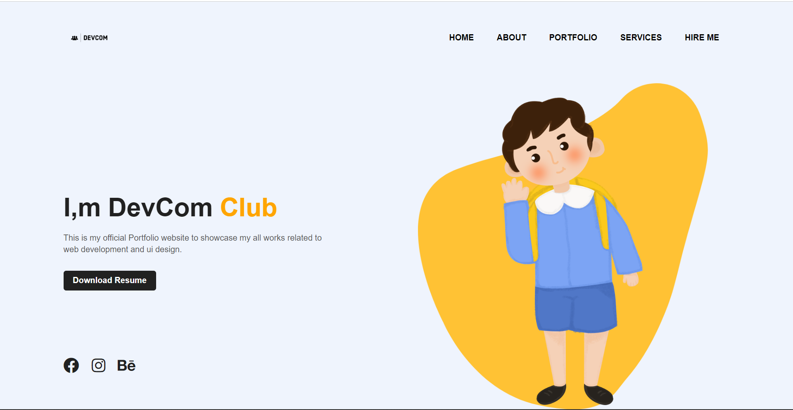

# 💻Portfolio Website💻
## 💥About💥

*This website is a unique way to showcase your **work** and let others know about **yourself**. It's like an evergreen **platform** for your projects, case studies, and information about you.*

## 📷Screenshots📷



## 🙌🏻Features🙌🏻

- By using this website, you can showcase yourself in front of the others.
- This website help you to make evergreen platform for your personal projects, and it also enhances your personality.

## 👨🏻‍💻Tech Stack👨🏻‍💻

- HTML
- CSS

## ⚙️Run Locally⚙️

Clone the project:-

```bash
git clone https://github.com/your-username/bootcamp_website.git
```

Go to the project directory:-

```bash
cd bootcamp_website
```

Start the server:-

```bash
Run the Live Server
```


## 🧑‍🤝‍🧑Contributing🧑‍🤝‍🧑

We welcome contributions to the Portfolio Website project! If you would like to contribute, please follow these guidelines:

- **Fork** this repository to your own GitHub account.
- **Clone** the repository to your local machine.
- **Create** your own branch and make changes.
- **Commit and push** your changes to your fork.
- **Create** a new pull request.


## Author

- [@abhayy143](https://github.com/abhayy143)

## Contributors
- [@maddy020](https://github.com/maddy020)
- [@Rishav1707](https://github.com/Rishav1707)
